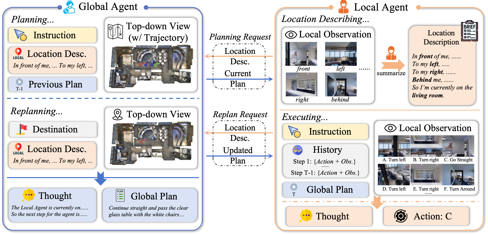

# DACo
This is the repo for **'Global Commander and Local Operative: A Dual-Agent Framework for Scene Navigation'**


## Setup
* **Prepare MP3D Simulator**: First, install Matterport3D simulators by following instructions in [Matterport3DSimulator](https://github.com/peteanderson80/Matterport3DSimulator).
* **Install requirements**: 
  ```bash
  conda create --name DACo python=3.10
  conda activate DACo
  pip install -r requirements.txt
  ```
* **Prepare Data**: 
  * **Connectivity**: The connectivity data are derived from [DUET](https://github.com/cshizhe/VLN-DUET/), and you can download [here](https://www.dropbox.com/scl/fo/4iaw2ii2z2iupu0yn4tqh/ADF-KvpLdfWnysPVs7fiVFU/R2R/connectivity?dl=0&rlkey=88khaszmvhybxleyv0a9bulyn&subfolder_nav_tracking=1).
  * **Annotations**: In our paper, we evaluate on three dataset.
    * **72 scenes on R2R**: download [MapGPT_72_scenes_processed.json](https://connecthkuhk-my.sharepoint.com/personal/jadge_connect_hku_hk/_layouts/15/onedrive.aspx?id=%2Fpersonal%2Fjadge%5Fconnect%5Fhku%5Fhk%2FDocuments%2FRelease%2FMapGPT&ga=1).
    * **R2R val unseen**: download [R2R_val_unseen_enc.json](https://www.dropbox.com/scl/fo/4iaw2ii2z2iupu0yn4tqh/AN7bYSotG-zBLzM11i2d0H8/R2R/annotations?dl=0&rlkey=88khaszmvhybxleyv0a9bulyn&subfolder_nav_tracking=1).
    * **REVERIE val unseen**: For quick, cost-effective testing and easier future work, we sampled a subset containing 200 instructions from the REVERIE validation unseen set, i.e. `REVERIE_val_unseen_enc.json`. We release our sampled subset, and it can be found at `datasets/REVERIE/annotations`.
  * **Observation Images**: The observation images need to be collected in advance from the simulator. We use the same images as MapGPT, which can be downloaded [here](https://connecthkuhk-my.sharepoint.com/personal/jadge_connect_hku_hk/_layouts/15/onedrive.aspx?id=%2Fpersonal%2Fjadge%5Fconnect%5Fhku%5Fhk%2FDocuments%2FRelease%2FMapGPT&ga=1)
  * **Top-down View Images**: We use the "Floor Plan" part of WayDataset as the global representation. The data includes bird's-eye view (BEV) images and a JSON file mapping viewpoints to pixel coordinates. Download [here](https://drive.google.com/uc?id=1_JHaTxty1cnZHnBKUWcNIgAPyCFx0nR7).
* **Environment Variables**: We present two options to run our code: api or a local LLM.
  * **API**: For API, you need to set your own API key by the following instruction.
    ```bash
    export API_KEY="xxxxx"
    ```
  * **Local LLM**: If you want to customize the LLM, set the base url to call your local model.
    ```bash
    export BASE_URL="http://..."
    ```
    > **A reminder**: Note that we prioritize calling API. If you want to run with your model and you've set the API_KEY, just remember to unset it.

## Inference
Run our code quickly with the provided script:
```bash
bash scripts/run.sh
```
Remember to customize the arguments before run the code:
```bash
--root_dir /path/to/datasets
--img_root /path/to/RGB_Observations/
--bev_dir /path/to/bev_images
--traj_img_dir bev_with_traj/<split_name>   # Output directory for trajectory visualizations
--split <split_name>    
--output_dir /path/to/save/output
--dataset r2r       # r2r or reverie
--max_action_len 15
--max_re_plan 1
--llm /path/to/your_model   # or a version of OPENAI model
--max_tokens 1000
```
> 📝 Due to the inherent randomness of LLMs, it is nearly impossible to reproduce the exact results reported in the paper, which are **averaged** over multiple runs. Minor fluctuations are normal. However, we guarantee that the performance consistently exceeds that of baseline methods.


